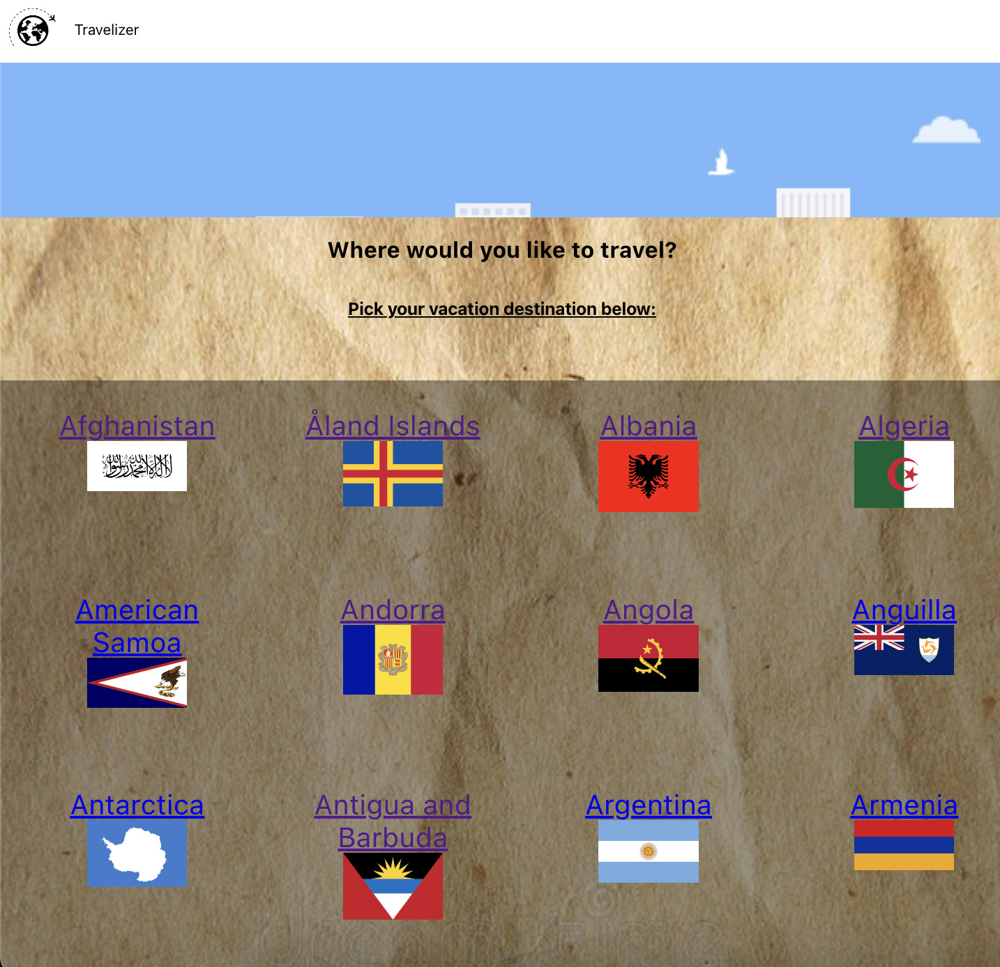
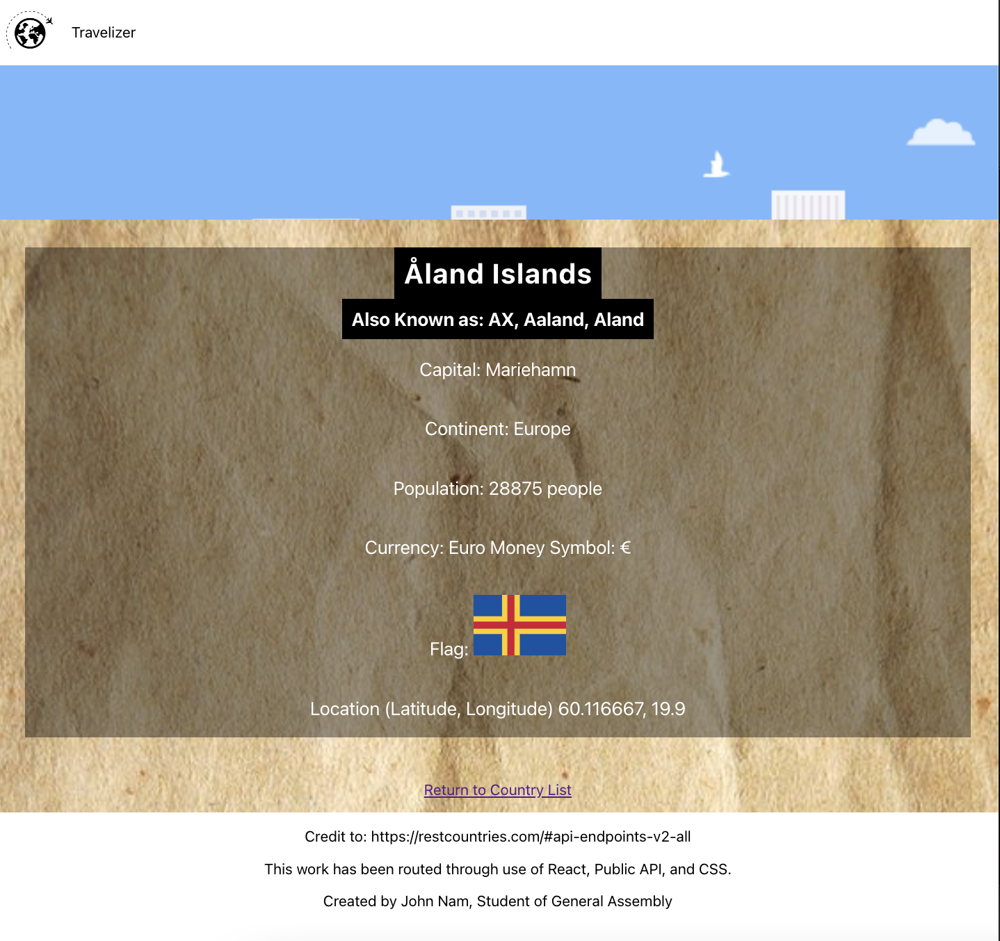

# Travel-Cities

## Project Description
My app is called Travelizer. This app will show list of countries for the user to determine which country to choose for their vacation time. User will be able to see all the list of countries in the database. When user clicks each country name, it will display country's name, capital city, currency, flag, phone code, and other information regarding to that country. In the future, I would like to add a feature to implement a second API for user to also see things to do list for each specific country.
Home

## Wireframes
Home


Country Detail Page


## Technologies used
I've mainly worked front-end with React and used a publi API to grab the data for list of countries. The language that I've used are Javascript, HTML and CSS.

## Images of the site




## MVP User Stories
* As a user, I want to see a list of all available countries that an user can travel to so they can decide which country they want to go for vacation time.

* As a user, I would like to click on the country to view the details (such as the city, flag, capital, currency) so that user can determine if they like the city to go or not.

* As a user, I want to have a navigation bar that always shows up whichever page I go to. (Either show or list)

## API
https://restcountries.com/v2/all

## Country API Successful data
```javascript
[
{
"name": "Japan",
"topLevelDomain": [
".jp"
],
"alpha2Code": "JP",
"alpha3Code": "JPN",
"callingCodes": [
"81"
],
"capital": "Tokyo",
"altSpellings": [
"JP",
"Nippon",
"Nihon"
],
"subregion": "Eastern Asia",
"region": "Asia",
"population": 125836021,
"latlng": [
36,
138
],
"demonym": "Japanese",
"area": 377930,
"gini": 32.9,
"timezones": [
"UTC+09:00"
],
"nativeName": "日本",
"numericCode": "392",
"flags": {
"svg": "https://flagcdn.com/jp.svg",
"png": "https://flagcdn.com/w320/jp.png"
},
"currencies": [
{
"code": "JPY",
"name": "Japanese yen",
"symbol": "¥"
}
],
"languages": [
{
"iso639_1": "ja",
"iso639_2": "jpn",
"name": "Japanese",
"nativeName": "日本語 (にほんご)"
}
],
"translations": {
"br": "Japan",
"pt": "Japão",
"nl": "Japan",
"hr": "Japan",
"fa": "ژاپن",
"de": "Japan",
"es": "Japón",
"fr": "Japon",
"ja": "日本",
"it": "Giappone",
"hu": "Japán"
},
"flag": "https://flagcdn.com/jp.svg",
"cioc": "JPN",
"independent": true
}
]
```

### Components Hierarchy


### Stretch Features
* Like to see if I can implement a second API (API for showing list of things to do in countries) to show in the countryDetails page
* Style improvements
* Add a country if not in the database
* Add a list of favorites that user can press a button